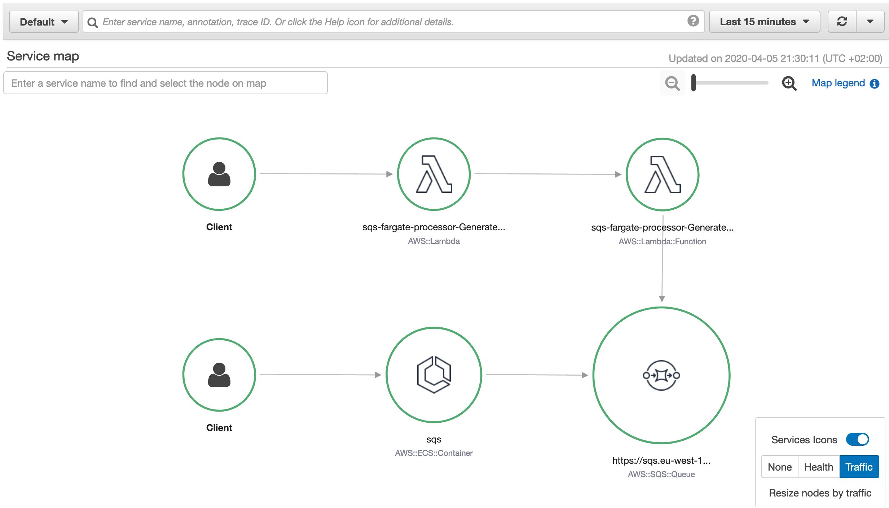
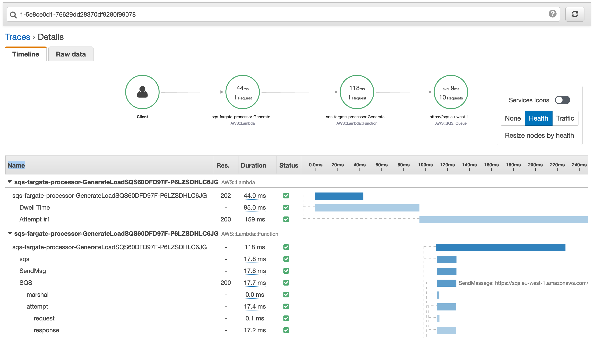

sqs-fargate-poller
==================

Deploy an SQS queue triggered Fargate container using the AWS CDK, which scales up or down depending on the amount of messages on the queue. In addition, a load generator Lambda is included which puts random messages on the SQS queue. The container and Lambda functions are instrumented with XRay which allows for precise monitoring of performance and success rates. 

The Lambda function and Fargate container are instrumented with XRay, so that you can review operational metrics from the XRay Service Map.

You can also inspect individual Lambda or Fargate traces to see how long AWS service calls and processing took.

Motivation
----------

While Lambda functions are great for event driven tasks from a cost and maintenance perspective, not every process can be easily ported to utilize them. You may already have a Docker container available for your solution which contains binaries or specific dependancies that can be tough to move to Lambda. In some other cases, more than 3GB memory is required during runtime or tasks need to run longer than 15 minutes. 

 Fargate with ECS deployed through CDK offers an alternative for these cases for the following reasons;

 - Fargate clusters and VPC's are free of charge, which means you do not have a fixed cost for running the solution. You only pay for the runtime of the Lambda function and the Fargate container, plus some costs for XRay, CloudWatch and SQS usage. 
 - You can provide Fargate containers with access to an EFS share in your VPC, which opens up new possibilities to process data compared to S3. 
  - All AWS resources, the Docker container and Lambda function can easily be deployed using the CDK. You can also make changes to the code on your machine and push it to AWS using 'cdk deploy'. 
 - In addition, all the components also don't require any ongoing maintenance or active monitoring to run. In case your stack breaks, you can easily revert to an older version of the stack of the CDK. 
 - You can import any Docker container into the solution and customize the amount of memory and CPU that it requires, ranging from 0.25 vCPU and 0.5GB of memory all the way up to 4 vCPU's and 30GB of memory. The process to do this easier will be documented and automated properly in the future.  

Installation
------------

You need to have the AWS CDK  installed on your local machine. In addition, Docker needs to be running on your machine as it's used to build the Go artifacts and Fargate container. 

Next, run 'cdk deploy' in the main directory. The Docker container and Lambda function will be built and deployed based on the locally stored sourcecode. 

Please note that it can take 5-10 minutes before Fargate tasks are scaled up to read messages from the queue. This is due to the alarm responding only after a few minutes to the increaes on messages on the SQS queue. 

Roadmap
-------

- [ ] Change alarm metric monitoring rate from every 5 minutes to every minute, so that Fargate scales more accurately depending on the amount of messages on the queue. 
- [ ] Add a simple process to add your own containers with the XRay and SQS instrumentation present. 
- [ ] Improve the amount of traces and segments that are captured through XRay. Currently all messages are captured in an inefficient way which can be costly at scale and may be over the XRay message limit of 64 KB per trace, which can lead to a loss of tracing data.  
- [ ] Build the Lambda Go binary natively through the CDK once this becomes available. 
- [X] Create the Lambda Go build process in Docker so no local tools need to be installed. 
- [X] Rewrite SQS generation Lambda to Golang (once CDK properly supports this or using a workaround to run 'go build').
- [X] Ensure tracing SQS messages end to end works well with XRay. Right now the messages aren't properly traced and visualized and show up as separate components on the XRay Service Map.

Contact
-------

In case you have any suggestions, questions or remarks, please raise an issue or reach out to @marekq.

